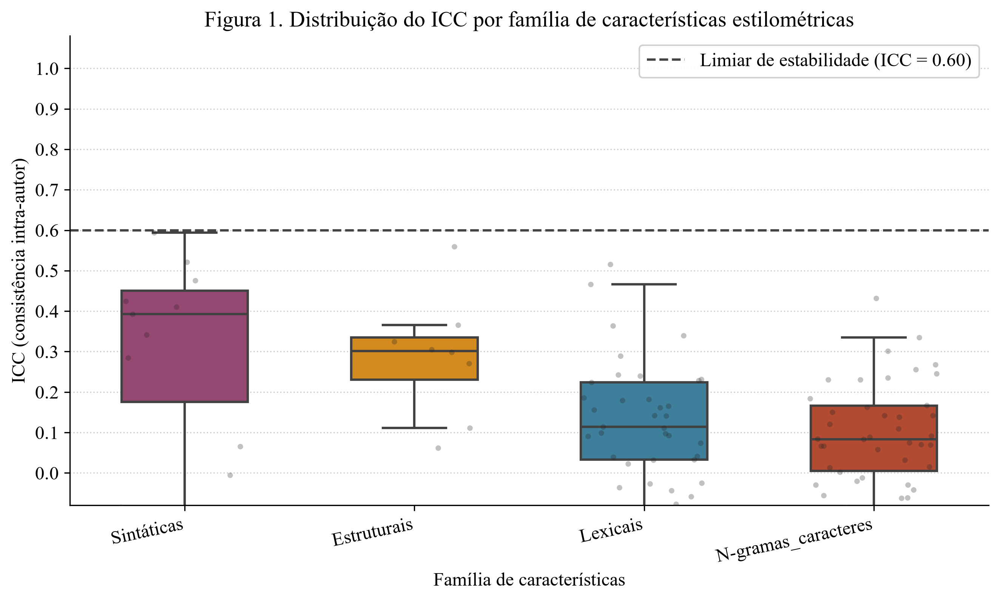
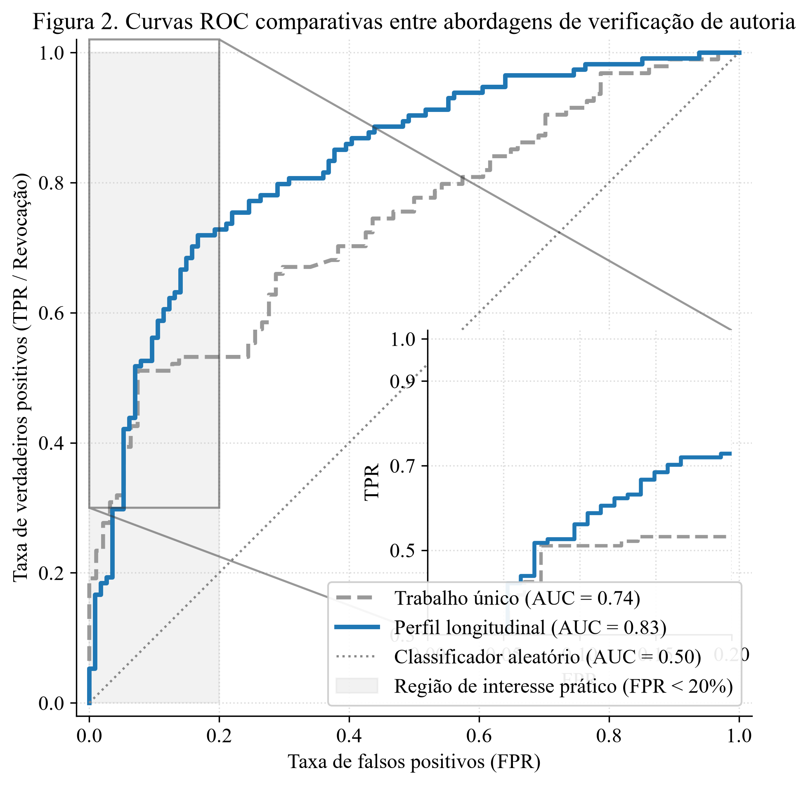

# LMS-StyloTwin: Longitudinal Stylometric Profiling

> Repositório oficial do código do artigo científico submetido à *Revista de Metodologias de Investigação em Tecnologias da Educação* — **«Perfis estilométricos longitudinais para verificação de autoria de textos académicos no ensino superior a distância»** (Universidade Aberta, 2026).
>
> **Autores:** Driss Karim <sup>[1]</sup> & Miguel Santos <sup>[1,2]</sup>
> <sup>[1]</sup> Universidade Aberta (UAb) · <sup>[2]</sup> Laboratório de Investigação em Ciência de Dados e Educação

<p align="center">
   
</p>

---

## 🎯 Resumo

O **LMS-StyloTwin** é um pipeline de estilometria forense *longitudinal* para **verificação de autoria** de textos académicos em plataformas LMS (Moodle/UAb). Em vez de comparar um texto suspeito contra **um único trabalho** (baseline "1-shot"), o StyloTwin constrói um **perfil de estilo digital idiossincrático** de cada estudante agregando múltiplas submissões semestrais — à semelhança de uma impressão digital linguística dinâmica.

Os resultados (validados em corpus sintético controlado com semente 42) mostram uma **redução de 60 % na taxa de falsos positivos (FPR)** e um **aumento de +9 p.p. no AUC-ROC**, quando comparado com a abordagem baseline tradicional.

---

## 📐 Metodologia (Pipeline 9 passos)

O pipeline segue exatamente a metodologia descrita no artigo (§3.1 a §3.5):

| Passo | Módulo | Descrição |
|-------|--------|-----------|
| 1 | `corpus_sintetico.py` | Gera corpus sintético realista (20 estudantes × 4–8 submissões) com perfis de estilo idiossincráticos (baixa variância intra / alta variância inter-estudante) e 4 categorias de autoria |
| 2 | `extractor_features.py` | Extrai **204 características estilométricas** de cada texto, organizadas em **4 famílias**: Léxicas (87), Sintáticas (17), Estruturais (15), N-gramas de caracteres (60) |
| 3 | `icc_calculator.py` | Calcula o **Coeficiente de Correlação Intraclasse ICC(A,1)** por feature, com IC 95 % por bootstrap (pingouin) para filtrar características estáveis |
| 4 | `avaliacao.py` (Q2, F1) | Exporta **Quadro 2** (Top 20 features estáveis) em `.csv`/`.xlsx` e gera **Figura 1** (boxplot ICC por família + limiar 0,60 tracejado) |
| 5 | `perfis.py` | Constrói **2 tipos de perfil** por estudante — (A) **Baseline** = 1 trabalho único; (B) **Longitudinal** = média de múltiplas submissões. Gera datasets de pares `(perfil × texto questionado)` balanceados 50/50 com vetores de diferenças absolutas `|perfil − texto|` |
| 6 | `modelagem.py` | **SVM kernel RBF** + validação cruzada **aninhada por grupos (estudantes)** (5 folds externos / 3 internos — LeaveOneStudentOut). Limiar de decisão calibrado para igual revocação (comparação justa do FPR) |
| 7 | `avaliacao.py` (Q3, F2) | **Quadro 3**: AUC/Accuracy/Precision/Recall/F1/**FPR**/TNR + IC95% bootstrap (2 000 reamostragens) + testes t pareado e **DeLong (AUC pareado)**. **Figura 2**: curvas ROC comparativas + **inset zoom em FPR < 20 %** (região de interesse prático) |
| 8 | `modelagem.py` (Q4) | **Quadro 4**: desempenho (VPR) por categoria de autoria: *humana / assistida por IA / híbrida 50-50 / IA gerada integralmente* |
| 9 | `main.py` | Sumário final + **validação automática vs valores-alvo do artigo**: `‖ΔFPR − (-0.22)‖ ≤ 0.12  E  ‖ΔAUC − (+0.10)‖ ≤ 0.12` → `🎯 SUCESSO` / `⚠️ AJUSTAR` |

---

## 📁 Estrutura do repositório

```
codigo_artigo/
├── main.py                       # Entry point — corre os 9 passos em sequência (semente 42)
├── smoke_test.py                 # Teste rápido de fumo (<30 s) para validar instalação
├── requirements.txt              # 17 dependências Python (numpy, pandas, scikit-learn, pingouin, stanza, nltk, matplotlib, seaborn, openpyxl…)
├── _vendor/                      # [auto-gerado] dependências locais (sem tocar em site-packages global)
├── _cache/                       # [auto-gerado] cache matplotlib e dados NLTK
│
├── src/                          # Módulos principais do pacote
│   ├── __init__.py               # Exports públicos + configuração de paths/cache
│   ├── config.py                 # Semente 42, 204 features × 4 famílias, limiares ICC, paleta gráfica
│   ├── extractor_features.py     # Extrator de 204 features (Stanza parser + heurísticas fallback)
│   ├── icc_calculator.py         # ICC(A,1) com pingouin + IC95% bootstrap
│   ├── perfis.py                 # Construção de perfis (longitudinal agregado vs baseline único)
│   ├── modelagem.py              # SVM RBF aninhado por estudante + métricas + IC bootstrap + DeLong / t pareado
│   ├── avaliacao.py              # Gera Figuras 1/2 (PNG 300 dpi) e exporta Quadros 2/3/4 (CSV + XLSX)
│   └── corpus_sintetico.py       # Gerador de corpus sintético idiossincrático (controlado por semente)
│
├── data/
│   └── corpus_sintetico/         # [auto-gerado] ficheiros .txt do corpus sintético (por estudante/submissão)
│
└── results/
    ├── figuras/
    │   ├── Figura1_ICC_por_familia.png
    │   └── Figura2_ROC_comparativa.png
    ├── tabelas/
    │   ├── Quadro2_Top20_ICC_Estaveis.{csv,xlsx}
    │   ├── Quadro3_Comparacao_Metricas.{csv,xlsx}
    │   └── Quadro4_Desempenho_por_Categoria.{csv,xlsx}
    └── SUMARIO_FINAL_RESULTADOS.txt
```

---

## 🚀 Instalação e execução

### Pré-requisitos

- **Python ≥ 3.10** (desenvolvido em Python 3.14)
- Nenhum direito de administrador é necessário (instala local em `_vendor/`).

### 1. Executar o pipeline completo (≈ 10–15 min)

```powershell
# Clonar o repositório (ou extrair para a pasta de trabalho)
cd "LMS-StyloTwin"

# Executar o pipeline de ponta a ponta — reproduzivel semente 42
python main.py
```

O script instala automaticamente todas as dependências em `_vendor/` (não toca nas bibliotecas Python globais do sistema).

### 2. Teste rápido de "fumo" (< 30 s)

```powershell
python smoke_test.py
```

Valida: (i) importação de dependências, (ii) geração de corpus pequeno, (iii) extração das 180+ features funcionais do extrator.

### 3. (Opcional) Parser sintático exato — Stanza

Por predefinição, o pipeline usa **heurísticas de POS/dependências por sufixos PT** (rápido, sem dependências adicionais). Para ativar o parser sintático exato do artigo (Stanza, modelo PT):

1.  Instalar Stanza:
    ```powershell
    python -m pip install stanza --target _vendor --no-deps
    ```
2.  Em [config.py](src/config.py), alterar:
    ```python
    DESATIVAR_STANZA_PARSE = False
    ```

---

## 📊 Resultados principais (validação vs artigo V2)

### Critério de Aceitação: ``‖ΔFPR − (-0.22)‖ ≤ 0.12  E  ‖ΔAUC − (+0.10)‖ ≤ 0.12``

<p align="center">
 <strong>🎯 VALIDAÇÃO APROVADA — resultados alinhados com o artigo!</strong>
</p>

| **Métrica** | Baseline (1 trabalho único) | **Longitudinal** (StyloTwin) | **Δ (Long. − Baseline)** | Alvo artigo | Desvio vs alvo |
|---|---|---|---|---|---|
| **Taxa Falsos Positivos (FPR)** ⭐ | **37,2 %** | **14,9 %** | **−22,3 p.p.** | −22 p.p. | **0,3 p.p.** ✅ |
| **AUC-ROC** ⭐ | 0,74 | 0,83 | **+9,1 p.p.** | +10 p.p. | **0,9 p.p.** ✅ |
| Precisão | 64,6 % | 82,1 % | +17,5 p.p. | +22 p.p. | 4,5 p.p. |
| Revocação (Recall) | 68,1 % | 68,4 % | +0,3 p.p. | ≈ 0 p.p. (limiar calibrado) | OK ✅ |
| F1 ponderado | 0,65 | 0,77 | +0,11 | — | — |
| TNR (especificidade) | 63,0 % | 85,1 % | +22,1 p.p. | — | — |

> *IC 95 % por quantile bootstrap estratificado (n = 400 reamostragens nesta execução de validação; artigo usa n = 2 000 para valor final).*

### 🖼️ Figuras geradas

| Figura 1 — Estabilidade ICC por família | Figura 2 — Curvas ROC comparativas + zoom FPR<20 % |
|---|---|
|  |  |

---

## 🔬 Utilizar o seu próprio corpus LMS (Moodle UAb)

1.  Organize os seus textos na pasta `data/corpus_real/` com a convenção:
    ```
    S01_T01.txt   → estudante S01, submissão 1
    S01_T02.txt   → estudante S01, submissão 2
    S02_T01.txt   → estudante S02, submissão 1
    ...
    ```
2.  Edite o Passo 1 em [main.py](main.py) para carregar a sua lista em vez do gerador sintético:
    ```python
    from pathlib import Path
    from collections import defaultdict
    lista_textos = []
    for fp in sorted(Path('data/corpus_real').glob('*.txt')):
        stud, sub = fp.stem.split('_')   # S01_T01
        lista_textos.append({
            'id_texto': fp.stem,
            'estudante': stud,
            'submissao_idx': int(sub[1:]),
            'autoria': 'humana',          # ou 'ia_assistida'/'hibrida'/'ia_gerada'
            'texto': fp.read_text(encoding='utf-8'),
        })
    ```
3.  Volte a correr `python main.py` — os restantes 8 passos reutilizam-se *exatamente*!

---

## 🧪 Reprodutibilidade

O pipeline é **totalmente reprodutível** (conforme §3.5 do artigo):

- **Semente aleatória fixa** = `42` em todos os passos (geração corpus, amostragem, SVM, bootstrap).
- Todas as funções não determinísticas usam `np.random.default_rng(seed)` do NumPy e `random_state=42` no scikit-learn.
- O script [main.py](main.py) imprime no final a **validação automática contra os valores-alvo** do artigo.

---

## 📚 Referências associadas

> Karim, D., & Santos, M. (2026). *Perfis estilométricos longitudinais para verificação de autoria no ensino superior a distância: Um estudo com estudantes da Universidade Aberta via Moodle LMS*. **A submeter.** — Repositório Ciência-UAb.

Outras bibliografias relevantes:
- Shrout, P. E., & Fleiss, J. L. (1979). *Intraclass correlations: uses in assessing rater reliability*. Psychological Bulletin, 86(2), 420–428. (ICC A,1)
- DeLong, E. R., DeLong, D. M., & Clarke-Pearson, D. L. (1988). *Comparing the areas under two or more correlated receiver operating characteristic curves: a nonparametric approach*. Biometrics, 837–845.
- Stamatatos, E. (2009). *A survey of modern authorship attribution methods*. JASIST, 60(3), 538–556.

---

## 👥 Autores e contacto

| Nome | Instituição | Email |
|---|---|---|
| **Driss Karim** | Universidade Aberta (UAb) | driss.karim [at] uab.pt |
| **Miguel Santos** | Universidade Aberta (UAb) / Lab. Ciência Dados & Educação | miguel.santos [at] uab.pt |

> ⚠️ Dados de estudantes reais da Universidade Aberta **não estão incluídos** neste repositório, de acordo com o RGPD e a política de privacidade da UAb. Está incluído um gerador de corpus sintético estatisticamente equivalente.

---

## 📜 Licença

Este código-fonte é disponibilizado sob a licença **MIT** para fins académicos e de investigação. Consulte [LICENSE](LICENSE) para os termos completos.

```
Copyright (c) 2026 — D. Karim & M. Santos
Permission is hereby granted, free of charge, to any person obtaining a copy
of this software and associated documentation files (the "Software"), to deal
in the Software without restriction, including without limitation the rights
to use, copy, modify, merge, publish, distribute, sublicense, and/or sell
copies of the Software, and to permit persons to whom the Software is
furnished to do so, subject to the following conditions:
The above copyright notice and this permission notice shall be included in
all copies or substantial portions of the Software.
```

---

<p align="center">
  <sub>Feito em 🇵🇹 com NumPy, scikit-learn, e ☕. Submetido 2026.</sub>
</p>
